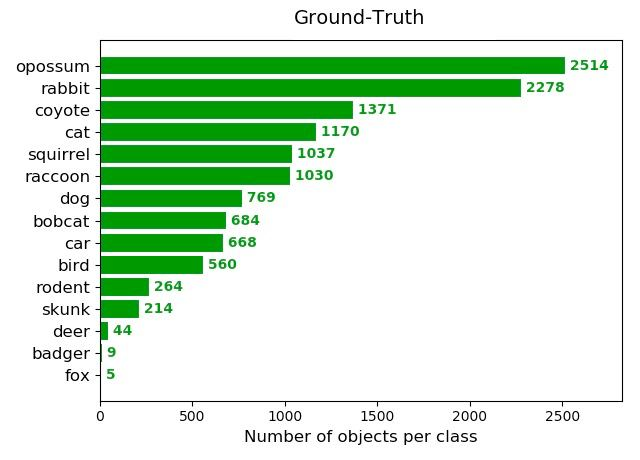
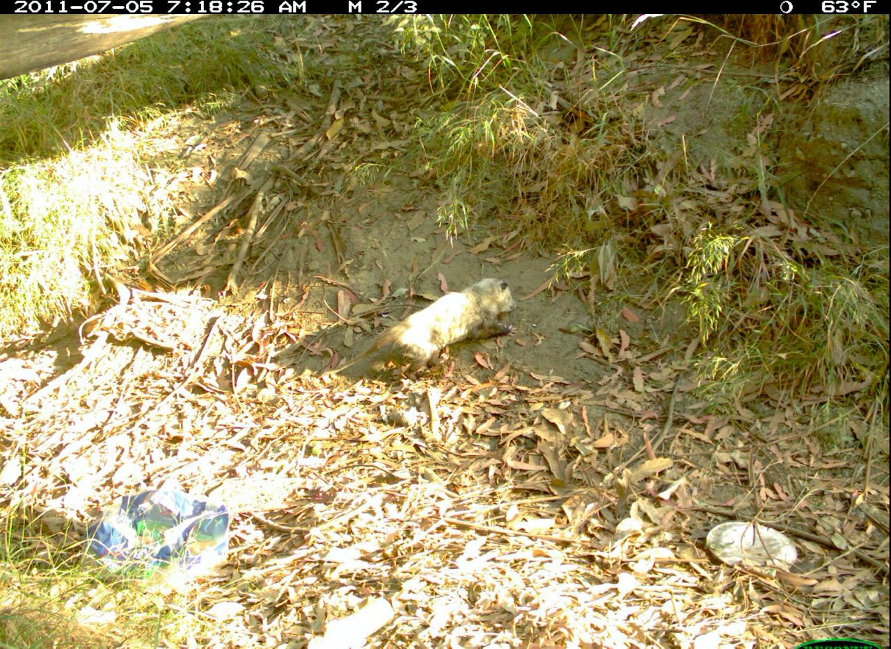
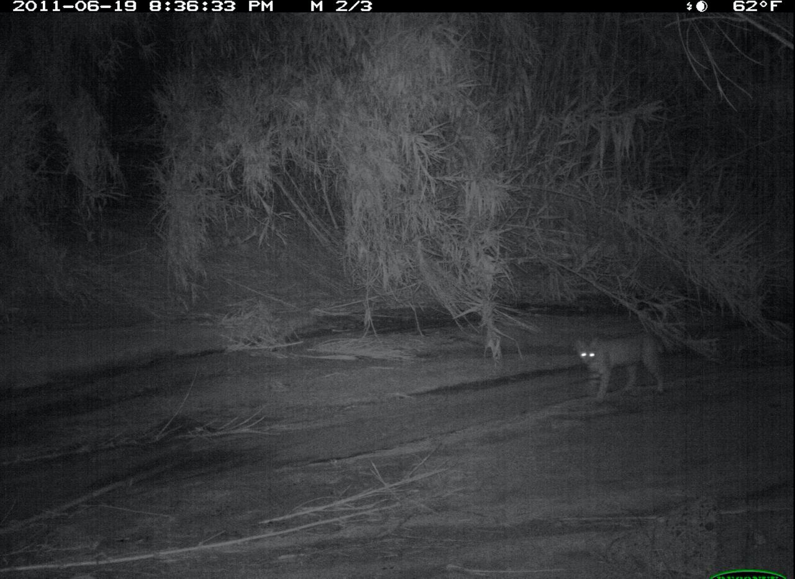

# Into The Wild: Animal Detection and Classification

## Quick Links

- [Into The Wild: Animal Detection and Classification](#into-the-wild-animal-detection-and-classification)
  - [Quick Links](#quick-links)
  - [About](#about)
  - [Setup](#setup)
  - [Dataset](#dataset)
  - [Training](#training)
  - [Result](#result)

## About

This repo contains codes covering how to do image detection and classification using [PyTorch](https://github.com/pytorch/pytorch) using Python 3.7.

**If you find any mistakes or disagree with any of the explanations, please do not hesitate to [submit an issue](https://github.com/arpanmukherjee/Into-The-Wild-Animal-Detection-and-Classification/issues/new). I welcome any feedback, be it positive or negative!**

## Setup

1. Download the GitHub repo by using the following command running from the terminal.

    ```bash
    git clone https://github.com/arpanmukherjee/Into-The-Wild-Animal-Detection-and-Classification.git
    cd Into-The-Wild-Animal-Detection-and-Classification/
    ```

2. Install `pip` from the terminal, for more details please look [here](https://pypi.org/project/pip/). Go to the following project folder and install all the dependencies by running the following command. By running this command, it will install all the dependencies you will require to run the project.

    ```bash
    pip install -r requirements.txt
    ```

## Dataset

We used [Caltech Camera Traps (CCT)](https://beerys.github.io/CaltechCameraTraps/) dataset containing `13553` camera trapped animal images in the jungle as our training dataset. For testing we had `1712` data points from the same dataset. Annotation format is the same as the MS COCO dataset.

<p align="center">
	<br>
	<code>Fig 1: Ground Truth Class ratio of Training Data</code>
</p>

Following are some of the sample images from the dataset, as you can see they are not very clear even for human eye.

<p align="center">
	
    
    
    <br>
	<code>Fig 2: Dataset Sample Images</code>
</p>

## Training

We have used the [Single Shot MultiBox Detector (SSD)](https://arxiv.org/abs/1512.02325) as our baseline model. As mentioned in the paper, we have used `VGG-16` as our primary backbone architecture for feature extraction.

Our batch size 


## Result
